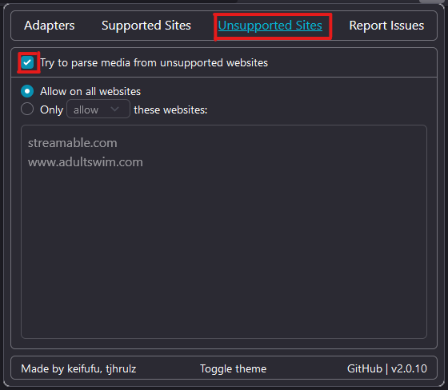
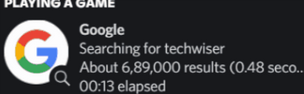

## How to add support for unsupported sites
Go to `Unsupported Sites` tab in the WebNowPlaying-Redux Browser Extension and tick the check box 

&#x2610; `Try to parse media from unsupported websites`

** Make sure it is set to allow on all websites for the extension to parse media on all sites

### Notes
The only downside in allowing this functionality would be that the `small_image` and `small_text` functionality in `pypresence` would not be working on the unsupported sites. 

However in rare ocassions the `large_image` and `large_text` would not be working as well

#### Explanation (Specially for Non-Tech Savvy people out there): 
- `large_image`: Google Logo
- `large_text`: Text that appears when you hover your mouse over the Google Logo
- `small_image`: The search icon in this case
- `small_text`: Text that appears when you hover your mouse over the search icon

